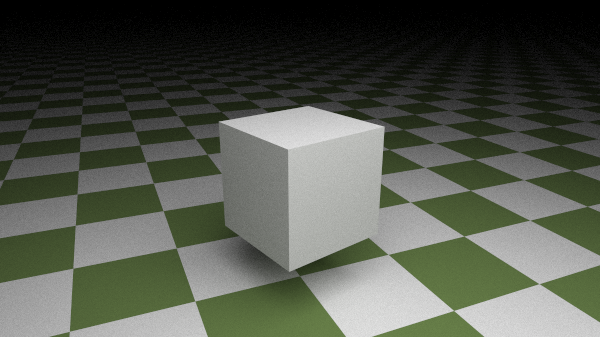
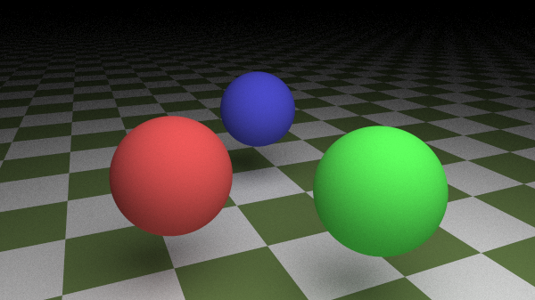
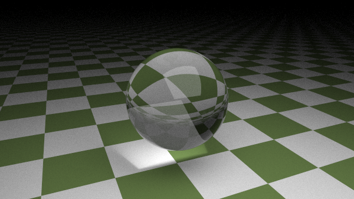
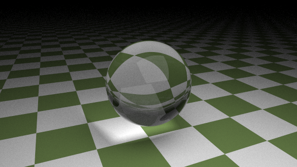
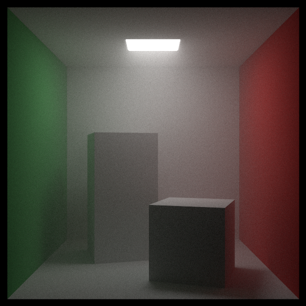
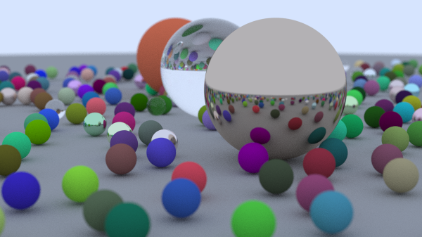

# Raytrace

Raytrace is a CPU-based ray tracing project implemented in Rust. This project
serves as both a hands-on experiment to deepen my understanding of ray tracing
concepts and a personal exploration of the Rust programming language.

The ray tracing techniques and concepts used in this project are inspired by a
three-part book series on implementing ray tracing with C++.
[https://raytracing.github.io/](https://raytracing.github.io/)

<div style="display: flex; flex-wrap: wrap; gap: 20px; justify-content: center;" align="center">
  
  
</div>

## Requirements

- [Rust](https://www.rust-lang.org/)
- [Make](https://www.gnu.org/software/make/manual/make.html)

## Usage

```Bash
$ raytrace --help
Usage: raytrace [OPTIONS] --config <CONFIG>

Options:
  -c, --config <CONFIG>    Path of toml configuration file
  -o, --output <OUTPUT>    Path of file to save the render to [default: render.png]
  -s, --samples <SAMPLES>  Directly override the sample count listed in the configuration file
  -h, --help               Print help
  -V, --version            Print version

$ raytrace --config examples/basic/render.toml --output render.png
┌─── Render Settings ────────────────────────────────────────────────────────────┐
│    Dimensions: 600x337                                                         │
│  Aspect Ratio: 16:9                                                            │
│       Samples: 300                                                             │
│   Max Bounces: 64                                                              │
│       Threads: 11                                                              │
│ Field of View: 20                                                              │
│     Look From: [13 , 2  , 3  ]                                                 │
│       Look At: [0  , 0  , 0  ]                                                 │
│           Vup: [0  , 1  , 0  ]                                                 │
│ Defocus Angle: 0.6                                                             │
│Focus Distance: 10                                                              │
│       Objects: 487                                                             │
└────────────────────────────────────────────────────────────────────────────────┘
Rendering: 100% (202200/202200)               3s
```

## Scene Configuration Specification

### Camera Configuration

The camera settings define how the scene is viewed and rendered. Below are the
parameters that control the camera's behavior:

```toml
[camera]
aspect_ratio = "square"
image_width = 600
samples = 10000
threads = 8
max_bounces = 64
fov = 40
look_from = [278.0, 278.0, -800.0]
look_at = [278.0, 278.0, 0.0]
vup = [0.0, 1.0, 0.0]

background = [0.70, 0.80, 0.99]

defocus_angle = 0.6
focus_dist = 10.0
```

- `aspect_ratio`: Specifies the aspect ration of the rendered image.
  - `widescreen` _(16:9)_
  - `square` _(1:1)_
  - `smartphone` _(9:16)_
  - `standard` _(4:3)_
  - `cinema` _(1.85:1)_
- `image_width`: The width of the rendered image.
- `samples`: The number of samples per pixel, controlling the quality of the
  image.
- `threads`: Determines how many CPU threads will be utilized during the
  rendering process, allowing for parallel computation to speed up the
  rendering. _(Defaults to the _n-1_ number of cores on your machine)_
- `max_bounces`: Limits the number of light bounces for each ray.
- `fov`: The camera's
  [field of view](https://en.wikipedia.org/wiki/Field_of_view) in degrees.
- `look_from`: The coordinates from which the camera views the scene.
- `look_at`: The point the camera is focused on.
- `vup`: Defines the camera's orientation. _(Defaults to the `[0.0, 1.0, 0.0]`
  where y positive is "up")_
- `background`: Set the rgb values for default color when a ray misses hitting
  an object. _(Defaults to black `[0.0, 0.0, 0.0]`)_
- `defocus_angle`: Variation angle of rays through each pixel _(Defaults to
  being disabled)_
- `focus_dist`: Distance from camera lookfrom point to plane of perfect focus
  _(Defaults to being disabled)_

### Objects

A scene consists of various objects, which are represented with combination of
"material" and "geometry" and can be configured using adding items to the list of
"objects".

### Geometry

#### Sphere


```toml
[[objects]]
shape = "sphere"
position = [0.0, 2.2, 0.0]
radius = 1.5
```

- `position`: The coordinates of the sphere's center.
- `radius`: The radius of the sphere.

#### Quad


```toml
[[objects]]
shape = "quad"
position = [2.0, 2.2, 2.0]
u = [-4.0, 0.0, 0.0]
v = [0.0, 0.0, -4.0]
```

- `position`: The origin point of the quad.
- `u`: The vector defining one side of the quad.
- `v`: The vector defining the adjacent side of the quad.

#### Cube



```toml
[[objects]]
shape = "cube"
a = [-1.0, -1.0, -1.0]
b = [1.0, 1.0, 1.0]
```

- `a`: The first corner of the cube (usually the minimum coordinate).
- `b`: The opposite corner (usually the maximum coordinate).

#### Triangle


```toml
[[objects]]
shape = "triangle"
a = [2.0, 0.0, 2.0]
b = [2.0, 0.0, -2.0]
c = [-2.0, 0.0, 0.0]
```

- `a`: The first vertices
- `b`: The second vertices
- `c`: The third vertices

#### Wavefront _(.obj file)_


```toml
[[objects]]
shape = "wavefront"
file = "teapot.obj"
```

- `file`: Path to the `.obj` file _(relative to config location)_

### Materials

Materials define the visual properties of the objects. Below are the supported
material types and their configurations in the TOML file.

#### Lambertian



```toml
[[objects]]
material = "lambertian"
albedo = [1.0, 0.2, 0.3] # red
```

- `albedo`: The diffuse reflection color as an RGB array.

#### Checkered


```toml
[[objects]]
material = "checkered"
even = [0.2, 0.3, 0.1] # light green
odd = [0.9, 0.9, 0.9] # white
scale = 0.2
```

- `even`: The color of the even checkered squares.
- `odd`: The color of the odd checkered squares.
- `scale`: Scaling factor to adjust the size of the checkered pattern.

#### Texture


```toml
[[objects]]
material = "texture"
file = "path/to/texture.png"
```

- `file`: Path to the texture file _(relative to config location)_

#### Noise


```toml
[[objects]]
material = "noise"
scale = 0.2
turbulance = 7
```

- `scale`: Controls the frequency of the noise pattern.
- `turbulence`: Level of turbulence in the noise.

#### Metal


```toml
[[objects]]
material = "metal"
albedo = [0.7, 0.7, 0.7]
roughness = 0.13
```

- `albedo`: The reflective color of the metal.
- `roughness`: Controls the scattering of reflected light. _(The higher more the
  more scattering)_

#### Dielectric


```toml
[[objects]]
material = "dielectric"
refraction_index = 1.5
```

- `refraction_index`: The index of refraction for the material.

#### Glass



```toml
[[objects]]
material = "glass"
```

_This is a dielectric of with an index of refraction of `1.5`_

#### Water



```toml
[[objects]]
material = "water"
```

_This is a dielectric of with an index of refraction of `1.33`_

#### Light


```toml
[[objects]]
material = "light"
emit = [7.0, 7.0, 7.0]
```

- `emit`: The RGB color of the emitted light.

## Examples

 
